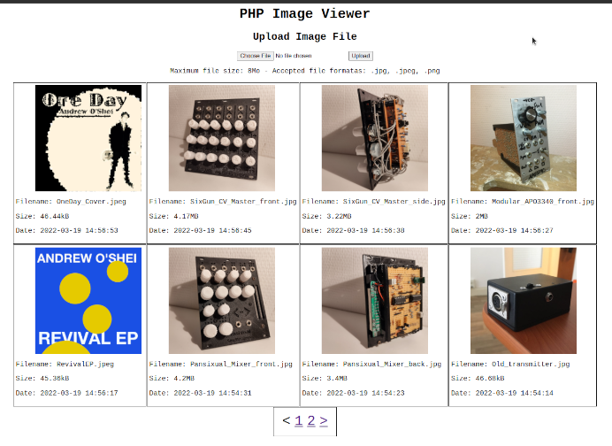

# PHP Image Viewer a.k.a. "Televerser une Image"

Il s'agit d'un projet démontrant le téléversement d'une image. Écrit en PHP, HTML et CSS, ce projet implémente une base de données MySQL pour l'archivage des données d'image. Les images envoyées au serveur Web sont stockées sur le serveur, puis rendues disponibles pour visualisation.

Lorsqu'une image est télécversée, à l'aide des boutons en haut de la page, la galerie de visualisation d'images est immédiatement mise à jour. Les images sont affichées de la plus récente (en haut à gauche) à la plus ancienne (en bas à droite). Les données d'image (nom, type, taille et date de téléchargement) sont affichées sous chaque image.

